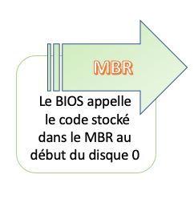
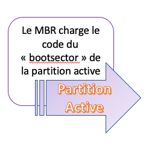
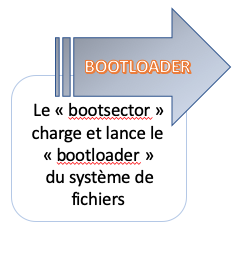
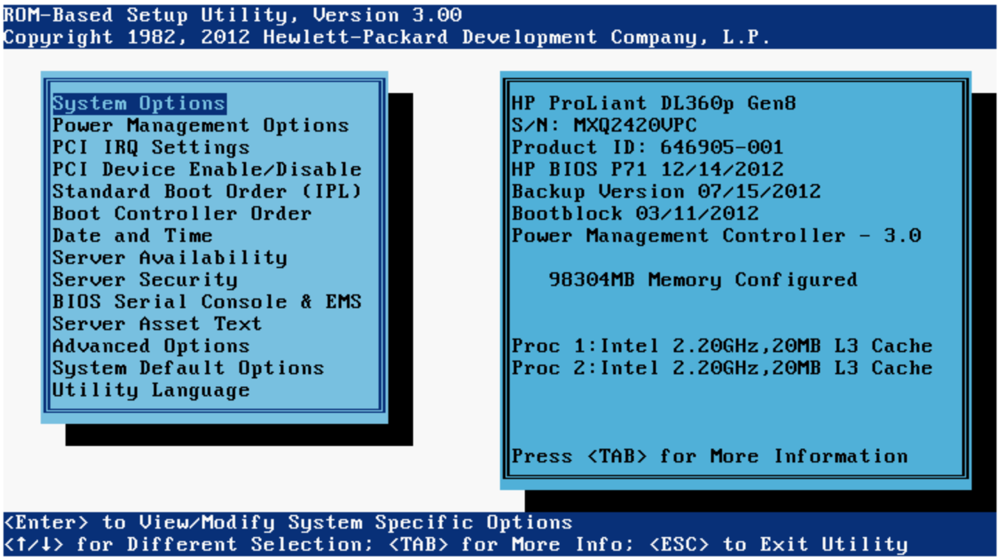
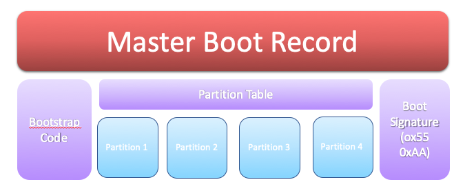
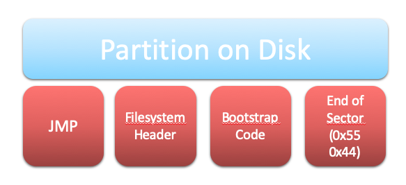
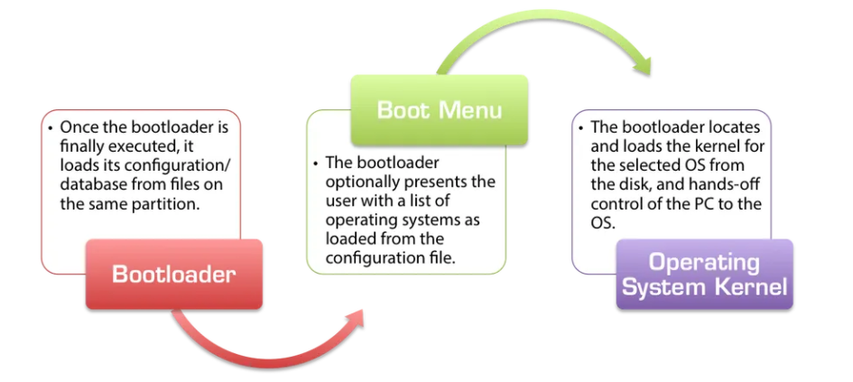
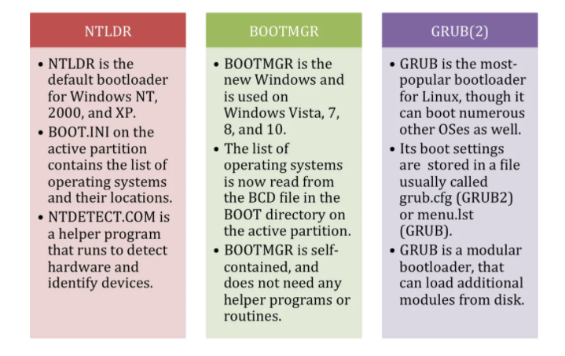
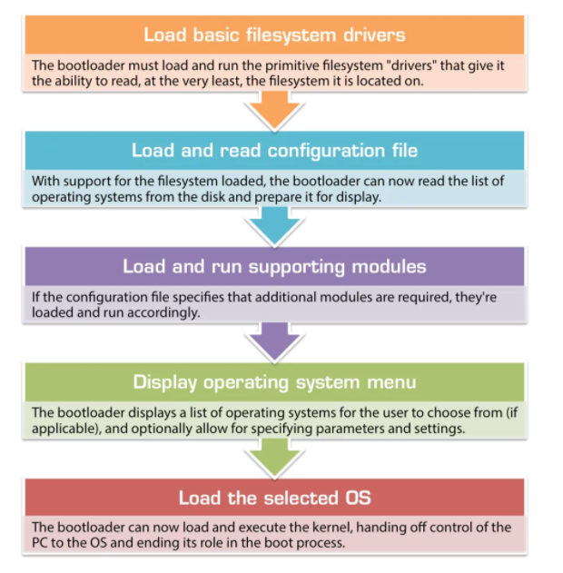

# Metal

## :o: BIOS :+1: MBR :+1: BootSector :+1: BootLoader 

| [BIOS](README.md#one-bios) | [MBR](README.md#two-mbr) | [BootSector](README.md#three-bootsector---partition-disk) | [BootLoader](README.md#three-bootloader) |
|----|---|---|---|
| </img> | </img> | </img> | </img> |

#### :one: BIOS

</img>

#### :two: MBR

Qu'est-ce que le [Master Boot Record](https://en.wikipedia.org/wiki/Master_boot_record)

</img>

#### :three: BootSector - Partition Disk

</img>

#### :three: BootLoader

</img>

</img>

## :a: Boot Process

</img>

Le bon vieux metal qui nous détourne de la virtualisation.

:m: Bare Metal(https://github.com/CollegeBoreal/Tutoriels/tree/main/O.OS/0.Metal)

# Références

[MBR Boot Process](https://neosmart.net/wiki/mbr-boot-process)

https://www.techradar.com/web-hosting/best-bare-metal-hosting
