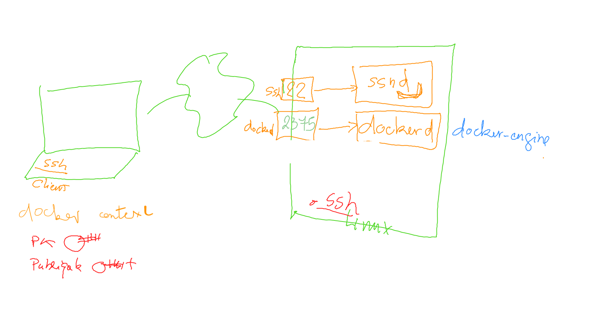

# [docker-engine](https://github.com/CollegeBoreal/Tutoriels/tree/main/2.MicroServices/1.Containers/2.Docker/1.Engine)

[:tada: Participation ](.scripts/Participation.md)

## :a: Installer une machine Générique

https://github.com/CollegeBoreal/Tutoriels/tree/main/2.MicroServices/1.Containers/2.Docker/1.Engine


 </img>


- [ ] Creer un contexte

```
docker context create rigel --docker "host=ssh://ubuntu@rigel.orion.gasy.africa"
```

```
docker context use rigel
```

- [ ] Lister les contextes 

* toutes les machines Note: :star:

```
docker context ls
```
> Retour
```
NAME        DESCRIPTION                               DOCKER ENDPOINT                        KUBERNETES ENDPOINT                                   ORCHESTRATOR
default     Current DOCKER_HOST based configuration   npipe:////./pipe/docker_engine         https://betelgeuse.orion.gasy.africa:6443 (default)   swarm
rigel   *                                             ssh://ubuntu@rigel.orion.gasy.africa             
saiph                                                 ssh://ubuntu@saiph.orion.gasy.africa                              
```


## :b: Installer un conteneur

- [ ] [Docker MySQL :point_left: ](Docker.md)

- [ ] nginx

```
docker container run --name some-nginx --publish 80:80 --detach nginx
```
